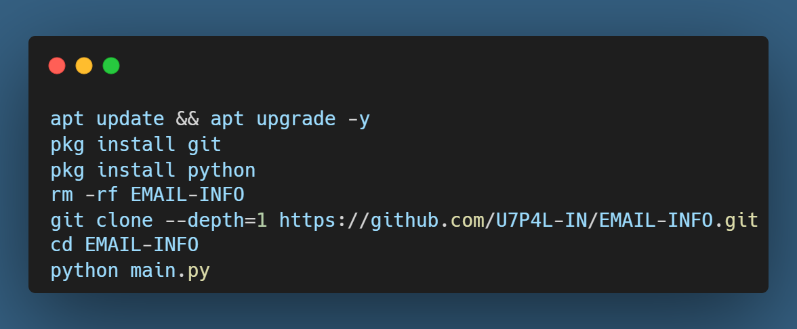

<p align="center">
</p>

</p>
   <p align="center">
      <a href="https://github.com/U7P4L-IN/EMAIL-INFO/stargazers">
      </a>
      <a href="https://github.com/U7P4L-IN/EMAIL-INFO/releases/latest">
      </a>
      <a href="https://www.conventionalcommits.org/en/v1.0.0/">
      </a>
      <a href="https://github.com/U7P4L-IN/EMAIL-INFO/actions/workflows/github-action.yml">
      </a>
   </p>
   
</br>

> An email information generator is a simple online tool designed to get user data of an email address.

### Features

- [x] Email Format Check: First, it examines the email address format to ensure it follows the correct structure.
- [x] Domain Validation: Next, it checks whether the domain name associated with the email address is valid.
- [x] Disposable Email Detection: It identifies whether the email address is a disposable one (used for temporary purposes).
- [x] MX Record Verification: Finally, it extracts MX records from the domain records and connects to the email server (via SMTP) to confirm whether the mailbox truly exists for that address1.

<h4 align="left">TESTED ON > </h4>

* Kali Linux
* Termux
* Mac os
* Ubuntu
* Perrot Sec OS

<h4 align="left">INSTALL TOOL ON TERMUX > </h4>
 
```python
apt update && apt upgrade -y
pkg install git
pkg install python
rm -rf EMAIL-INFO
git clone --depth=1 https://github.com/U7P4L-IN/EMAIL-INFO.git
cd EMAIL-INFO
python main.py
```
<p align="center">

<h3 align="left"><b>TERMUX > </b></h3>

<p align="center">
<p align="center";> 


# Report bugs
If you notice issues while installing this tool or running this tool kindly mail to me at <a href="mailto: lisame0007@gmail.com">Gmail</a> or Open an issue via github.

### Requirements 
```
python-3
pip
Internet Connection
And some other python packages
``` 
[Python 3](https://www.python.org/downloads/)

<hr>
<h3 align="left">Install Requirements (on Linux) > </h3>

```python
>> apt-get install git python3 python3-pip python python-pip
```
<h3 align="left">Kali Linux/Ubuntu/Parrot os > </h3>

```python
sudo apt-get update && apt-get install git
git clone https://github.com/U7P4L-IN/EMAIL-INFO.git
cd EMAIL-INFO
ls
sudo python3 main.py
```
<h3 align="left"><b>KALI LINUX ></b></h3>

<p align="center">
<p align="center">
<p align="center">

<p align="center">  <a href="https://t.me/TheU7p4lArmyX"></a></p>

### Tools Languages :

<p align="center">

</p>

<br>

### No EMAIL-INFOs appearing?

- Doesn't work for some temp mail!
- Maybe your email account is checkpointed or locked.
- The email genarating system has been repaired causing failure to get email informetion.

### Contributing
Feel Free To Clone This Project. For Major Changes, Please Open An Issue First To Discuss What You Would Like To Change Or Add, Thank You!!.

<h2 align="center">LICENSE</h2>

**EMAIL INFORMATION** Genareting is released under the MIT license, which grants the following permissions:
- Commercial use
- Modification
- Distribution
- Patent use
- Private use

For more convoluted language, see the [LICENSE](/LICENSE).
</br>

<h5 align="center"><b>DESCRIPTION</b></h5>


* ©️ Copyright Message
>> Copyright © [2023-27] [U7P4L-IN]
>All rights reserved. This Python project, along with its code, documentation, and any associated files, is the intellectual property of ANONYMOUS CYBER. You may not reproduce, distribute, or modify the contents of this repository without explicit permission from the owner.

### Give A Star ⭐

> You can also give this repository a star to show more people and they can use this repository.